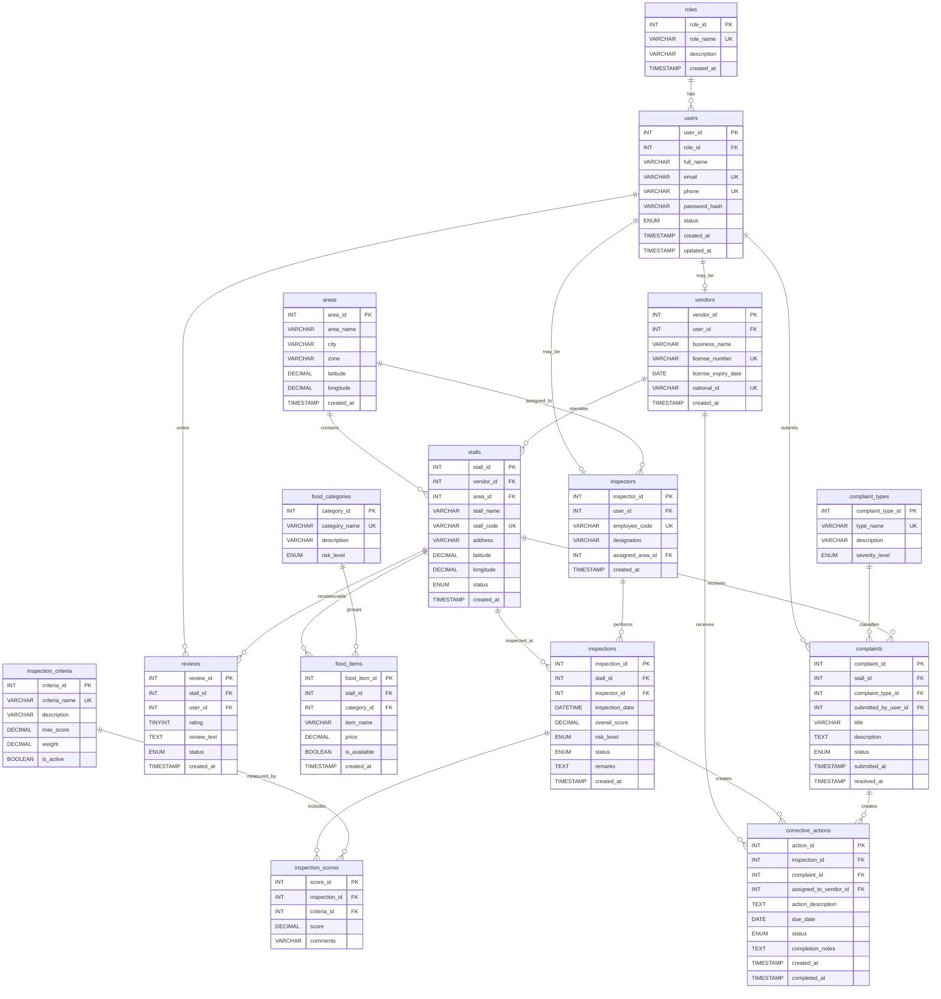

# Smart Street Food Safety Inspection and Risk Analysis System

## Database Overview

Database name: `smart_street_food_safety`

The database supports role-based users, vendor and inspector profiles, area and stall registration, food cataloging, inspections, scored criteria, public complaints and reviews, and corrective action tracking.

## Tables

### 1. roles

Attributes:

| Attribute | Type | Constraints |
|---|---:|---|
| role_id | INT | Primary key, auto increment |
| role_name | VARCHAR(50) | Not null, unique |
| description | VARCHAR(255) | Nullable |
| created_at | TIMESTAMP | Default current timestamp |

Primary key: `role_id`

Foreign keys: None

Relationships and cardinality:

- One role can be assigned to many users.
- `roles` 1:N `users`

### 2. users

Attributes:

| Attribute | Type | Constraints |
|---|---:|---|
| user_id | INT | Primary key, auto increment |
| role_id | INT | Not null, foreign key to `roles.role_id` |
| full_name | VARCHAR(120) | Not null |
| email | VARCHAR(150) | Not null, unique |
| phone | VARCHAR(30) | Nullable, unique |
| password_hash | VARCHAR(255) | Not null |
| status | ENUM('active', 'inactive', 'suspended') | Not null, default 'active' |
| created_at | TIMESTAMP | Default current timestamp |
| updated_at | TIMESTAMP | Default current timestamp on update current timestamp |

Primary key: `user_id`

Foreign keys:

- `role_id` references `roles(role_id)`

Constraints:

- Email must be unique.
- Phone should be unique when provided.
- Status is limited to active, inactive, or suspended.

Relationships and cardinality:

- Many users belong to one role.
- One user can have one vendor profile.
- One user can have one inspector profile.
- One user can submit many complaints.
- One user can write many reviews.
- `roles` 1:N `users`
- `users` 1:0..1 `vendors`
- `users` 1:0..1 `inspectors`
- `users` 1:N `complaints`
- `users` 1:N `reviews`

### 3. vendors

Attributes:

| Attribute | Type | Constraints |
|---|---:|---|
| vendor_id | INT | Primary key, auto increment |
| user_id | INT | Not null, unique, foreign key to `users.user_id` |
| business_name | VARCHAR(150) | Not null |
| license_number | VARCHAR(80) | Not null, unique |
| license_expiry_date | DATE | Nullable |
| national_id | VARCHAR(80) | Nullable, unique |
| created_at | TIMESTAMP | Default current timestamp |

Primary key: `vendor_id`

Foreign keys:

- `user_id` references `users(user_id)`

Constraints:

- A vendor profile must belong to exactly one user.
- A user cannot have more than one vendor profile.
- License number must be unique.

Relationships and cardinality:

- One vendor may operate many stalls.
- One vendor may receive many reviews through their stalls.
- `users` 1:0..1 `vendors`
- `vendors` 1:N `stalls`

### 4. inspectors

Attributes:

| Attribute | Type | Constraints |
|---|---:|---|
| inspector_id | INT | Primary key, auto increment |
| user_id | INT | Not null, unique, foreign key to `users.user_id` |
| employee_code | VARCHAR(80) | Not null, unique |
| designation | VARCHAR(100) | Nullable |
| assigned_area_id | INT | Nullable, foreign key to `areas.area_id` |
| created_at | TIMESTAMP | Default current timestamp |

Primary key: `inspector_id`

Foreign keys:

- `user_id` references `users(user_id)`
- `assigned_area_id` references `areas(area_id)`

Constraints:

- A user cannot have more than one inspector profile.
- Employee code must be unique.

Relationships and cardinality:

- One inspector can perform many inspections.
- One area can have many inspectors assigned.
- `users` 1:0..1 `inspectors`
- `areas` 1:N `inspectors`
- `inspectors` 1:N `inspections`

### 5. areas

Attributes:

| Attribute | Type | Constraints |
|---|---:|---|
| area_id | INT | Primary key, auto increment |
| area_name | VARCHAR(120) | Not null |
| city | VARCHAR(100) | Not null |
| zone | VARCHAR(100) | Nullable |
| latitude | DECIMAL(10,8) | Nullable |
| longitude | DECIMAL(11,8) | Nullable |
| created_at | TIMESTAMP | Default current timestamp |

Primary key: `area_id`

Foreign keys: None

Constraints:

- `area_name`, `city`, and `zone` should be unique as a combined location identifier.
- Latitude and longitude are optional for map features.

Relationships and cardinality:

- One area can contain many stalls.
- One area can have many assigned inspectors.
- `areas` 1:N `stalls`
- `areas` 1:N `inspectors`

### 6. stalls

Attributes:

| Attribute | Type | Constraints |
|---|---:|---|
| stall_id | INT | Primary key, auto increment |
| vendor_id | INT | Not null, foreign key to `vendors.vendor_id` |
| area_id | INT | Not null, foreign key to `areas.area_id` |
| stall_name | VARCHAR(150) | Not null |
| stall_code | VARCHAR(80) | Not null, unique |
| address | VARCHAR(255) | Not null |
| latitude | DECIMAL(10,8) | Nullable |
| longitude | DECIMAL(11,8) | Nullable |
| status | ENUM('active', 'closed', 'suspended') | Not null, default 'active' |
| created_at | TIMESTAMP | Default current timestamp |

Primary key: `stall_id`

Foreign keys:

- `vendor_id` references `vendors(vendor_id)`
- `area_id` references `areas(area_id)`

Constraints:

- Stall code must be unique.
- Status is limited to active, closed, or suspended.

Relationships and cardinality:

- Many stalls belong to one vendor.
- Many stalls are located in one area.
- One stall can sell many food items.
- One stall can have many inspections.
- One stall can receive many complaints.
- One stall can receive many reviews.
- `vendors` 1:N `stalls`
- `areas` 1:N `stalls`
- `stalls` 1:N `food_items`
- `stalls` 1:N `inspections`
- `stalls` 1:N `complaints`
- `stalls` 1:N `reviews`

### 7. food_categories

Attributes:

| Attribute | Type | Constraints |
|---|---:|---|
| category_id | INT | Primary key, auto increment |
| category_name | VARCHAR(100) | Not null, unique |
| description | VARCHAR(255) | Nullable |
| risk_level | ENUM('low', 'medium', 'high') | Not null, default 'medium' |

Primary key: `category_id`

Foreign keys: None

Constraints:

- Category name must be unique.
- Risk level is limited to low, medium, or high.

Relationships and cardinality:

- One category can include many food items.
- `food_categories` 1:N `food_items`

### 8. food_items

Attributes:

| Attribute | Type | Constraints |
|---|---:|---|
| food_item_id | INT | Primary key, auto increment |
| stall_id | INT | Not null, foreign key to `stalls.stall_id` |
| category_id | INT | Not null, foreign key to `food_categories.category_id` |
| item_name | VARCHAR(150) | Not null |
| price | DECIMAL(10,2) | Nullable |
| is_available | BOOLEAN | Not null, default true |
| created_at | TIMESTAMP | Default current timestamp |

Primary key: `food_item_id`

Foreign keys:

- `stall_id` references `stalls(stall_id)`
- `category_id` references `food_categories(category_id)`

Constraints:

- Price must be greater than or equal to zero when provided.
- A stall should not duplicate the same food item name within the same category.

Relationships and cardinality:

- Many food items belong to one stall.
- Many food items belong to one category.
- `stalls` 1:N `food_items`
- `food_categories` 1:N `food_items`

### 9. inspection_criteria

Attributes:

| Attribute | Type | Constraints |
|---|---:|---|
| criteria_id | INT | Primary key, auto increment |
| criteria_name | VARCHAR(150) | Not null, unique |
| description | VARCHAR(255) | Nullable |
| max_score | DECIMAL(5,2) | Not null |
| weight | DECIMAL(5,2) | Not null, default 1.00 |
| is_active | BOOLEAN | Not null, default true |

Primary key: `criteria_id`

Foreign keys: None

Constraints:

- Criteria name must be unique.
- Maximum score must be greater than zero.
- Weight must be greater than zero.

Relationships and cardinality:

- One criterion can be scored in many inspection score records.
- `inspection_criteria` 1:N `inspection_scores`

### 10. inspections

Attributes:

| Attribute | Type | Constraints |
|---|---:|---|
| inspection_id | INT | Primary key, auto increment |
| stall_id | INT | Not null, foreign key to `stalls.stall_id` |
| inspector_id | INT | Not null, foreign key to `inspectors.inspector_id` |
| inspection_date | DATETIME | Not null |
| overall_score | DECIMAL(6,2) | Nullable |
| risk_level | ENUM('low', 'medium', 'high', 'critical') | Nullable |
| status | ENUM('draft', 'submitted', 'approved', 'rejected') | Not null, default 'draft' |
| remarks | TEXT | Nullable |
| created_at | TIMESTAMP | Default current timestamp |

Primary key: `inspection_id`

Foreign keys:

- `stall_id` references `stalls(stall_id)`
- `inspector_id` references `inspectors(inspector_id)`

Constraints:

- Inspection date is required.
- Status is limited to draft, submitted, approved, or rejected.
- Risk level is limited to low, medium, high, or critical when provided.

Relationships and cardinality:

- Many inspections belong to one stall.
- Many inspections are performed by one inspector.
- One inspection has many criterion scores.
- One inspection can create many corrective actions.
- `stalls` 1:N `inspections`
- `inspectors` 1:N `inspections`
- `inspections` 1:N `inspection_scores`
- `inspections` 1:N `corrective_actions`

### 11. inspection_scores

Attributes:

| Attribute | Type | Constraints |
|---|---:|---|
| score_id | INT | Primary key, auto increment |
| inspection_id | INT | Not null, foreign key to `inspections.inspection_id` |
| criteria_id | INT | Not null, foreign key to `inspection_criteria.criteria_id` |
| score | DECIMAL(5,2) | Not null |
| comments | VARCHAR(255) | Nullable |

Primary key: `score_id`

Foreign keys:

- `inspection_id` references `inspections(inspection_id)`
- `criteria_id` references `inspection_criteria(criteria_id)`

Constraints:

- Score must be greater than or equal to zero.
- One criterion should be scored only once per inspection.
- Unique key: `(inspection_id, criteria_id)`

Relationships and cardinality:

- Many score records belong to one inspection.
- Many score records use one criterion.
- `inspections` 1:N `inspection_scores`
- `inspection_criteria` 1:N `inspection_scores`

### 12. complaint_types

Attributes:

| Attribute | Type | Constraints |
|---|---:|---|
| complaint_type_id | INT | Primary key, auto increment |
| type_name | VARCHAR(100) | Not null, unique |
| description | VARCHAR(255) | Nullable |
| severity_level | ENUM('low', 'medium', 'high', 'critical') | Not null, default 'medium' |

Primary key: `complaint_type_id`

Foreign keys: None

Constraints:

- Complaint type name must be unique.
- Severity level is limited to low, medium, high, or critical.

Relationships and cardinality:

- One complaint type can classify many complaints.
- `complaint_types` 1:N `complaints`

### 13. complaints

Attributes:

| Attribute | Type | Constraints |
|---|---:|---|
| complaint_id | INT | Primary key, auto increment |
| stall_id | INT | Not null, foreign key to `stalls.stall_id` |
| complaint_type_id | INT | Not null, foreign key to `complaint_types.complaint_type_id` |
| submitted_by_user_id | INT | Nullable, foreign key to `users.user_id` |
| title | VARCHAR(150) | Not null |
| description | TEXT | Not null |
| status | ENUM('open', 'under_review', 'resolved', 'rejected') | Not null, default 'open' |
| submitted_at | TIMESTAMP | Default current timestamp |
| resolved_at | TIMESTAMP | Nullable |

Primary key: `complaint_id`

Foreign keys:

- `stall_id` references `stalls(stall_id)`
- `complaint_type_id` references `complaint_types(complaint_type_id)`
- `submitted_by_user_id` references `users(user_id)`

Constraints:

- Complaint description is required.
- Status is limited to open, under_review, resolved, or rejected.
- Submitted user may be null to allow anonymous public complaints.

Relationships and cardinality:

- Many complaints belong to one stall.
- Many complaints are classified by one complaint type.
- One user can submit many complaints.
- One complaint can lead to many corrective actions.
- `stalls` 1:N `complaints`
- `complaint_types` 1:N `complaints`
- `users` 1:N `complaints`
- `complaints` 1:N `corrective_actions`

### 14. reviews

Attributes:

| Attribute | Type | Constraints |
|---|---:|---|
| review_id | INT | Primary key, auto increment |
| stall_id | INT | Not null, foreign key to `stalls.stall_id` |
| user_id | INT | Not null, foreign key to `users.user_id` |
| rating | TINYINT | Not null |
| review_text | TEXT | Nullable |
| status | ENUM('visible', 'hidden', 'flagged') | Not null, default 'visible' |
| created_at | TIMESTAMP | Default current timestamp |

Primary key: `review_id`

Foreign keys:

- `stall_id` references `stalls(stall_id)`
- `user_id` references `users(user_id)`

Constraints:

- Rating must be between 1 and 5.
- A user should have only one review per stall unless the product decision allows repeat reviews.
- Suggested unique key: `(stall_id, user_id)`

Relationships and cardinality:

- Many reviews belong to one stall.
- Many reviews are written by one user.
- `stalls` 1:N `reviews`
- `users` 1:N `reviews`

### 15. corrective_actions

Attributes:

| Attribute | Type | Constraints |
|---|---:|---|
| action_id | INT | Primary key, auto increment |
| inspection_id | INT | Nullable, foreign key to `inspections.inspection_id` |
| complaint_id | INT | Nullable, foreign key to `complaints.complaint_id` |
| assigned_to_vendor_id | INT | Not null, foreign key to `vendors.vendor_id` |
| action_description | TEXT | Not null |
| due_date | DATE | Not null |
| status | ENUM('pending', 'in_progress', 'completed', 'overdue', 'cancelled') | Not null, default 'pending' |
| completion_notes | TEXT | Nullable |
| created_at | TIMESTAMP | Default current timestamp |
| completed_at | TIMESTAMP | Nullable |

Primary key: `action_id`

Foreign keys:

- `inspection_id` references `inspections(inspection_id)`
- `complaint_id` references `complaints(complaint_id)`
- `assigned_to_vendor_id` references `vendors(vendor_id)`

Constraints:

- Action description and due date are required.
- Status is limited to pending, in_progress, completed, overdue, or cancelled.
- At least one source should exist: `inspection_id` or `complaint_id`.

Relationships and cardinality:

- Many corrective actions can belong to one inspection.
- Many corrective actions can belong to one complaint.
- Many corrective actions can be assigned to one vendor.
- `inspections` 1:N `corrective_actions`
- `complaints` 1:N `corrective_actions`
- `vendors` 1:N `corrective_actions`

## Relational Schema

```text
roles(
  role_id PK,
  role_name UNIQUE,
  description,
  created_at
)

users(
  user_id PK,
  role_id FK -> roles.role_id,
  full_name,
  email UNIQUE,
  phone UNIQUE,
  password_hash,
  status,
  created_at,
  updated_at
)

vendors(
  vendor_id PK,
  user_id FK -> users.user_id UNIQUE,
  business_name,
  license_number UNIQUE,
  license_expiry_date,
  national_id UNIQUE,
  created_at
)

inspectors(
  inspector_id PK,
  user_id FK -> users.user_id UNIQUE,
  employee_code UNIQUE,
  designation,
  assigned_area_id FK -> areas.area_id,
  created_at
)

areas(
  area_id PK,
  area_name,
  city,
  zone,
  latitude,
  longitude,
  created_at,
  UNIQUE(area_name, city, zone)
)

stalls(
  stall_id PK,
  vendor_id FK -> vendors.vendor_id,
  area_id FK -> areas.area_id,
  stall_name,
  stall_code UNIQUE,
  address,
  latitude,
  longitude,
  status,
  created_at
)

food_categories(
  category_id PK,
  category_name UNIQUE,
  description,
  risk_level
)

food_items(
  food_item_id PK,
  stall_id FK -> stalls.stall_id,
  category_id FK -> food_categories.category_id,
  item_name,
  price,
  is_available,
  created_at,
  UNIQUE(stall_id, category_id, item_name)
)

inspection_criteria(
  criteria_id PK,
  criteria_name UNIQUE,
  description,
  max_score,
  weight,
  is_active
)

inspections(
  inspection_id PK,
  stall_id FK -> stalls.stall_id,
  inspector_id FK -> inspectors.inspector_id,
  inspection_date,
  overall_score,
  risk_level,
  status,
  remarks,
  created_at
)

inspection_scores(
  score_id PK,
  inspection_id FK -> inspections.inspection_id,
  criteria_id FK -> inspection_criteria.criteria_id,
  score,
  comments,
  UNIQUE(inspection_id, criteria_id)
)

complaint_types(
  complaint_type_id PK,
  type_name UNIQUE,
  description,
  severity_level
)

complaints(
  complaint_id PK,
  stall_id FK -> stalls.stall_id,
  complaint_type_id FK -> complaint_types.complaint_type_id,
  submitted_by_user_id FK -> users.user_id NULL,
  title,
  description,
  status,
  submitted_at,
  resolved_at
)

reviews(
  review_id PK,
  stall_id FK -> stalls.stall_id,
  user_id FK -> users.user_id,
  rating,
  review_text,
  status,
  created_at,
  UNIQUE(stall_id, user_id)
)

corrective_actions(
  action_id PK,
  inspection_id FK -> inspections.inspection_id NULL,
  complaint_id FK -> complaints.complaint_id NULL,
  assigned_to_vendor_id FK -> vendors.vendor_id,
  action_description,
  due_date,
  status,
  completion_notes,
  created_at,
  completed_at,
  CHECK(inspection_id IS NOT NULL OR complaint_id IS NOT NULL)
)
```

## Mermaid ER Diagram



## Normalization Explanation Up To 3NF

### First Normal Form

The design satisfies 1NF because every table has a primary key, every attribute stores a single atomic value, and repeating groups are separated into child tables. For example, an inspection does not store multiple scores in repeated columns; individual criterion scores are stored in `inspection_scores`.

### Second Normal Form

The design satisfies 2NF because all non-key attributes depend on the full primary key of their table. Most tables use single-column surrogate primary keys, which avoids partial dependency. Associative/detail tables such as `inspection_scores` also enforce the meaningful pair `(inspection_id, criteria_id)` as unique, while `score` and `comments` describe that exact inspection-criterion combination.

### Third Normal Form

The design satisfies 3NF because non-key attributes do not depend on other non-key attributes. Lookup and classification data are separated into their own tables:

- Role names are stored in `roles`, not repeated in `users`.
- Area information is stored in `areas`, not repeated in `stalls` or `inspectors`.
- Food category risk information is stored in `food_categories`, not repeated in `food_items`.
- Inspection criteria definitions are stored in `inspection_criteria`, not repeated in every inspection.
- Complaint severity metadata is stored in `complaint_types`, not repeated in every complaint.

This reduces update anomalies, insert anomalies, and delete anomalies. For example, changing the severity of a complaint type requires updating one row in `complaint_types`, not many rows in `complaints`.

## Notes For Future Implementation

- MySQL 8.0.16 or later enforces `CHECK` constraints. If using an older MySQL version, enforce checks in application logic or triggers.
- Add indexes on foreign key columns for faster joins and reports.
- Risk scores can be calculated from `inspection_scores.score`, `inspection_criteria.max_score`, and `inspection_criteria.weight`, then stored in `inspections.overall_score` as a snapshot.
- The `corrective_actions` table supports actions from either inspections, complaints, or both.
